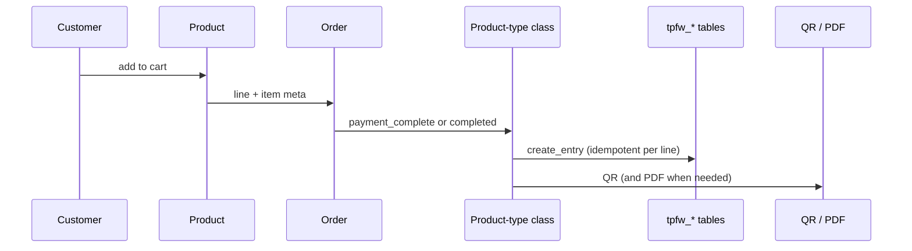

# Architecture

In depth: [product-types.md](product-types.md), [check-in.md](check-in.md), [files-and-access.md](files-and-access.md), [emails-and-admin.md](emails-and-admin.md).

The plugin is split into **subsystems**. Each subsystem is a class that registers its own hooks from its constructor. `TPFW_Main` instantiates them and keeps only a shared `TPFW_Functions` facade. Integrity-critical helpers live in `inc/support/` (`TPFW_Issue_Policy`, `TPFW_Order_Line_Upsert`, `TPFW_Named_Lock`, `TPFW_Checkin_Payload`, …) and are loaded first via `inc/support/load.php`.

## Boot

1. `tickets-passes-for-woocommerce.php` defines constants (`TPFW_PLUGIN_DIR`, `TPFW_VERSION`, `TPFW_REWRITE_VERSION`) and hooks activation/deactivation.
2. On `init` (priority 20) it constructs `TPFW_Main`, which calls `load_dependencies()`.
3. `inc/support/load.php` then the database installer, then `TPFW_Functions` (shared facade).
4. Everything else loads **conditionally** from settings (`tpfw_general_settings_options`) and from the scanner/API toggles.

Rewrite rules (`/check-in/`, My Account tabs) flush once per `TPFW_REWRITE_VERSION`, late on `wp_loaded`, after every class has registered its rules.

Activation creates the tables and the upload folder. It does **not** flush permalinks — that happens on the next request. Deactivation clears cron (timeslots and QR rewrite batches) and rewrite. Uninstall (`uninstall.php`) always removes settings and the scanner role; tables and QR/PDF files are removed only when `TPFW_REMOVE_ALL_DATA` is `true`.

## Subsystems

```
TPFW_Main
 ├── TPFW_DB_Installer          always
 ├── TPFW_Functions             always (shared)
 ├── TPFW_File_Access           always (QR/PDF/photo must never be switched off)
 ├── TPFW_API                   if API or scanner is on
 ├── TPFW_Scanner               if scanner is on
 ├── TPFW_Emails                always
 ├── product type + My Account  if that type is on in settings
 ├── TPFW_Cronjobs              if Ticket or Timeslot is on
 └── (admin) settings, dashboards, analytics, order metabox
```

Admin classes are constructed only inside `is_admin()`. The Ticket/Timeslot/Pass settings screens still load when the type is off, so it can be turned back on.

## Purchase → issue



- **Ticket** (`TPFW_Ticket_WC_Product`): validity window, max uses per QR, optional customer-picked start date. How many may be sold is the product's stock (`_manage_stock` / `_stock`). `valid_duration` is stored in **seconds**.
- **Timeslot Ticket**: a concrete time slot with capacity. Unpaid reservations are released by cron. Cart/checkout lives in `TPFW_Timeslot_Ticket_Checkout`.
- **Pass**: period entitlement, optional guest passes (`parent_nano_id_fk`, `guest_slot` 1…N), photo, cooldown.

Issuing uses one `TPFW_Issue_Policy` of **events**, not payment-method IDs. Automatic mint is `woocommerce_payment_complete` → `order_payment_complete()` and `woocommerce_order_status_completed` → `order_status_completed()`. Both share `issue_order_lines()` → `create_entry()`. `woocommerce_order_status_processing` is not an issue trigger: an unpaid Processing order (typical cash-on-delivery checkout) waits until Completed or the admin **Create** metabox (`order_completed()` → `order_force_issue()`). `pending` / `on-hold` do not mint. The same `nano_id` is kept if payment_complete later reaches completed (upsert).

Cancelled / refunded / failed orders call `cancel_entry` (soft delete: `deleted` is set, the row is not removed), via `TPFW_Issue_Policy::should_revoke()`.

Partial refunds use `woocommerce_order_refunded` → `order_refunded()` → `TPFW_Refund_Policy`. Target active quantity is **purchased item qty minus refunded ITEM qty**. Surplus rows are soft-deleted in `id ASC` order (keep the earliest, revoke the last). Amount-only refunds (refunded item qty = 0) do not change issued rows; a full-order status of `refunded` still revokes everything. The same math is used when issuing, so a later Create does not remint refunded items. Quantity is never inferred from money. Soft-deleting a timeslot ticket frees that seat.

## Locks

Integrity-critical writes take a MySQL named lock (`TPFW_Named_Lock` / `GET_LOCK`). Anything other than a held lock is a refusal (**fail-closed**). There is no wrapping transaction across database + filesystem + mail.

| Area | Lock | Protects |
|---|---|---|
| Check-in | `tpfw_checkin_{nano_id}` | Stats INSERT and guest activation |
| Ticket issue | `tpfw_ticket_issue_{order_line_id}` | Upsert for that line |
| Pass issue | `tpfw_pass_issue_{order_line_id}` | Upsert for that line |
| Guest quota | `tpfw_guest_{parent_nano_id}` | Slot assign / mint under `UNIQUE(parent, guest_slot)` |
| Timeslot capacity | `tpfw_timeslot_{timeslot_id}` | Reserve and issue |

## Writes vs artefacts

Critical issue/revoke `$wpdb` results are checked (`TPFW_Db_Write`). `false` is not treated as success: no QR file, order-line nano-id meta or gift mail is produced for a row that did not land. That is fail-closed on the database step, not a two-phase commit.

## Check-in

The QR payload is the REST URL

`/wp-json/tpfw/v1/scanner/checkin/{nano_id}`

The scanner at `/check-in/` does **not** open that URL in the browser. It extracts the `nano_id` (any host) and **POST**s the same REST path on its own origin while logged in. GET on the check-in routes is registered only to answer **405**. All decision logic lives on the server in `TPFW_Functions::checkin()`, under a MySQL named lock per `nano_id` (`TPFW_Named_Lock`: anything other than a held lock is a refusal, HTTP 202). The success body is an allowlist (`TPFW_Checkin_Payload`), not the raw row.

The same `checkin()` is used by:

- the door scanner (REST POST)
- manual check-in on the admin dashboards (AJAX)

The AJAX callback will also accept a logged-in holder of that row, with the validity window still enforced, but My Account has no check-in button.

Permission: [Who may scan](check-in.md#who-may-scan) — `tpfw_scanner` role, or `manage_woocommerce`. Shop-owner steps: [install.md](install.md#scanner-users).

Guest passes have their own route: `/scanner/checkin/{nano_id}/guest`.

## Files

Generated files live under `uploads/tpfw-{random}/`. Every link the plugin emits goes through `TPFW_File_Access` (`?tpfw_file=`). QR and guest images require a signed HMAC; PDFs and profile photos accept the owner’s session, `manage_woocommerce`, or HMAC. Apache may honour the folder `.htaccess`. nginx and IIS ignore it — they need the deny rule in [server-config/](server-config/README.md).
