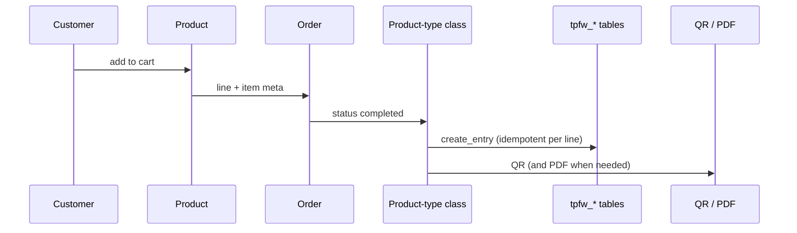

# Architecture

In depth: [product-types.md](product-types.md), [check-in.md](check-in.md), [files-and-access.md](files-and-access.md), [emails-and-admin.md](emails-and-admin.md).

The plugin is split into **subsystems**. Each subsystem is a class that registers its own hooks from its constructor. `TPFW_Main` instantiates them and keeps only a shared `TPFW_Functions`.

## Boot

1. `tickets-passes-for-woocommerce.php` defines constants (`TPFW_PLUGIN_DIR`, `TPFW_VERSION`, `TPFW_REWRITE_VERSION`) and hooks activation/deactivation.
2. On `init` (priority 20) it constructs `TPFW_Main`, which calls `load_dependencies()`.
3. The database installer runs first. Then `TPFW_Functions` (shared helper).
4. Everything else loads **conditionally** from settings (`tpfw_general_settings_options`) and from the scanner/API toggles.

Rewrite rules (`/check-in/`, My Account tabs) flush once per `TPFW_REWRITE_VERSION`, late on `wp_loaded`, after every class has registered its rules.

Activation creates the tables and the upload folder. It does **not** flush permalinks — that happens on the next request. Deactivation clears cron and rewrite. Uninstall (`uninstall.php`) always removes settings and the scanner role; tables and QR/PDF files are removed only when `TPFW_REMOVE_ALL_DATA` is `true`.

## Subsystems

```
TPFW_Main
 ├── TPFW_DB_Installer          always
 ├── TPFW_Functions             always (shared)
 ├── TPFW_File_Access           always (QR/PDF/photo must never be switched off)
 ├── TPFW_API                   if API or scanner is on
 ├── TPFW_Scanner               if scanner is on
 ├── TPFW_Emails                always
 ├── product type + My Account  if that type is on in settings
 ├── TPFW_Cronjobs              if Ticket or Timeslot is on
 └── (admin) settings, dashboards, analytics, order metabox
```

Admin classes are constructed only inside `is_admin()`. The Ticket/Timeslot/Pass settings screens still load when the type is off, so it can be turned back on.

## Purchase → issue



- **Ticket** (`TPFW_Ticket_WC_Product`): validity window, max uses per QR, optional customer-picked start date. How many may be sold is the product's stock (`_manage_stock` / `_stock`). `valid_duration` is stored in **seconds**.
- **Timeslot Ticket**: a concrete time slot with capacity. Unpaid reservations are released by cron.
- **Pass**: period entitlement, optional guest passes (`parent_nano_id_fk`), photo, cooldown.

Issuing hooks `woocommerce_order_status_completed`. An order that stays in `processing` (for example cash on delivery) does not get plugin table rows until it is completed.

Cancelled / refunded / failed orders call `cancel_entry` (soft delete: `deleted` is set, the row is not removed).

## Check-in

The QR payload is the REST URL

`/wp-json/tpfw/v1/scanner/checkin/{nano_id}`

The scanner at `/check-in/` does **not** open that URL in the browser. It extracts the `nano_id` (any host) and calls the same REST endpoint while logged in. All decision logic lives on the server in `TPFW_Functions::checkin()`, under a MySQL named lock per `nano_id`.

The same `checkin()` is used by:

- the door scanner
- manual check-in on the admin dashboard
- optional check-in from My Account

Permission: the `tpfw_scanner` role, or `manage_woocommerce`.

Guest passes have their own route: `/scanner/checkin/{nano_id}/guest`.

## Files

Generated files live under `uploads/tpfw-{random}/` and are **never** served as static URLs. Every link goes through `TPFW_File_Access`, which requires the signed-in owner or a signed link.
